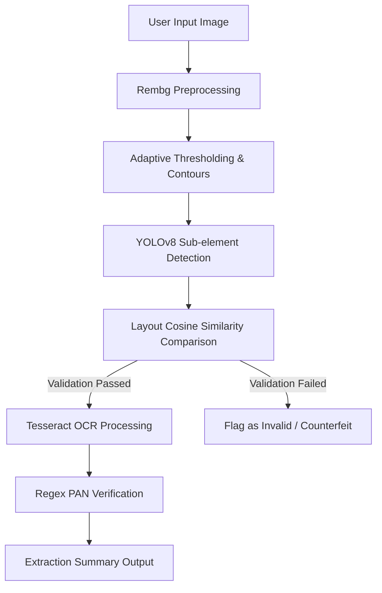

# 🔍 PanOptic-YOLO: AI-Powered PAN Card Verification & Parsing Engine

An advanced computer vision and deep learning pipeline designed to autonomously detect, verify, and parse Indian Permanent Account Number (PAN) cards. By orchestrating State-of-the-Art (SOTA) object detection with high-fidelity Optical Character Recognition (OCR) and structural verification metrics, **PanOptic-YOLO** offers a robust end-to-end solution for automated identity document validation.

---

## ✨ Key Features

- **🎯 SOTA Object Detection:** Utilizes a custom-trained **YOLOv8** model to detect PAN cards and structural sub-elements with high confidence under varied angles, lighting, and environments.
- **🖼️ Intelligent Preprocessing:** Integrates automated background removal (`rembg`) and adaptive thresholding to isolate cards and maximize OCR accuracy.
- **📝 High-Fidelity OCR:** Leverages **Tesseract OCR** with structured bounding box analysis to extract name, father's name, date of birth, and unique identification numbers.
- **🔒 Anti-Spoofing & Layout Verification:**
  - **Cosine Similarity Verification:** Compares bounding-box geometry matrices of user-input cards against validated templates to detect fake or structural-anomaly documents.
  - **Structural Similarity Index (SSIM):** Computes pixel-level structural fidelity between original and processed documents.
  - **HSD (Hue-Saturation-Difference) Profile:** Builds a dual-channel color profile histogram comparison to identify color grading abnormalities or printing inconsistencies.
- **🚦 Regex Validation:** Formulates pattern matching of isolated text strings to confirm the valid Indian PAN pattern (`[A-Z]{5}[0-9]{4}[A-Z]`).

---

## 🛠️ Technology Stack

- **Deep Learning / Object Detection:** YOLOv8 (`ultralytics`)
- **Computer Vision:** OpenCV (`opencv-python`), Pillow (`PIL`)
- **Image Processing & Analysis:** Scikit-Image (`skimage`), Scikit-Learn (`sklearn`)
- **OCR Engine:** Tesseract OCR (`pytesseract`)
- **UI & File System:** EasyGUI, Matplotlib
- **Automation & Background Stripping:** Rembg

---

## 🚀 Getting Started

### Prerequisites

1. **Python 3.8+**
2. **Tesseract OCR Engine:**
   - Install Tesseract on your local machine.
   - For Windows, update the path in `check.py`:
     ```python
     pytesseract.pytesseract.tesseract_cmd = r'C:/Program Files/Tesseract-OCR/tesseract.exe'
     ```

### Installation

Clone the repository and install the dependencies:

```bash
# Clone the repository
git clone https://github.com/your-username/PanOptic-YOLO.git
cd PanOptic-YOLO

# Install required packages
pip install ultralytics opencv-python numpy matplotlib rembg Pillow easygui scikit-image scikit-learn pytesseract
```

---

## ⚙️ How It Works



1. **Isolation:** The background is dynamically removed, leaving only the card. Grayscale histograms and brightness metrics are generated.
2. **Detection & Alignment:** YOLOv8 localizes elements on the card.
3. **Fidelity Audit:** Cosine similarity compares the relative bounding box layouts with a ground-truth template.
4. **Text Extraction:** OCR isolates name/DOB and highlights the unique 10-character alphanumeric PAN, passing it through regex validation.

---

## 📁 Project Structure

- `fullcode.py` — The core research pipeline covering preprocessing, SSIM, HSD feature vectors, and YOLO detection.
- `check.py` — Main execution script for validation, comparing user-input documents against reference layouts and parsing OCR details.
- `removebg.py` — Background removal standalone script.
- `best (5).pt` — The custom-trained YOLOv8 weights optimized for card and sub-element detection.

---

## 📜 License

Distributed under the MIT License. See `LICENSE` for more information.
