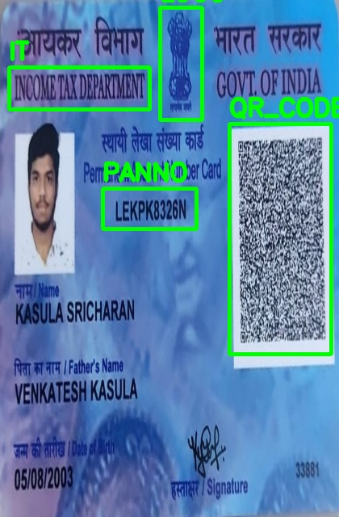
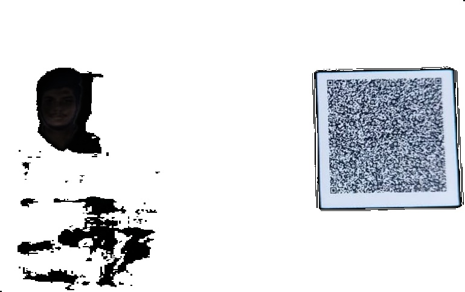
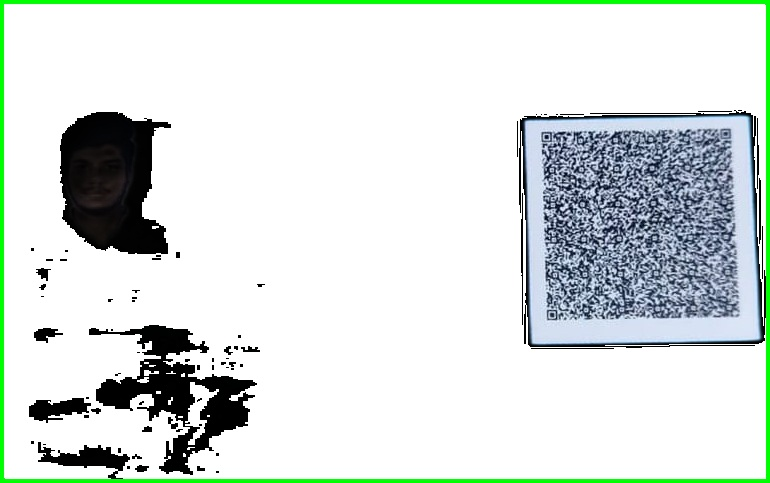
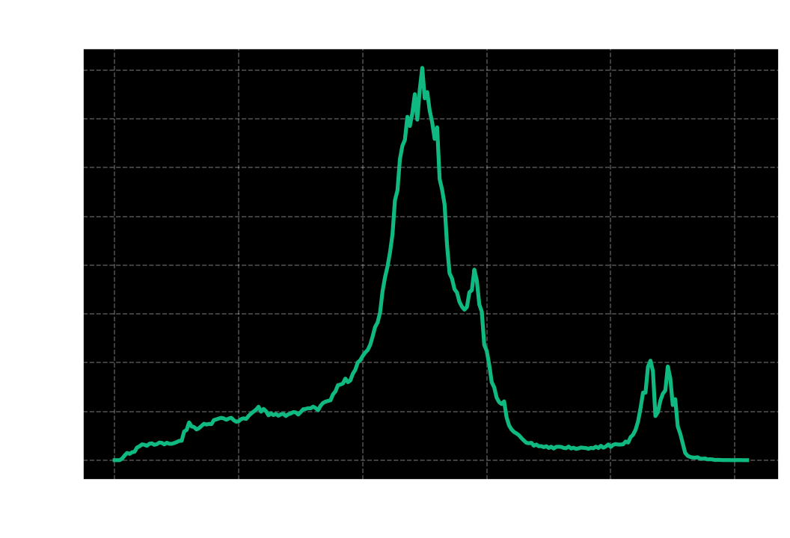
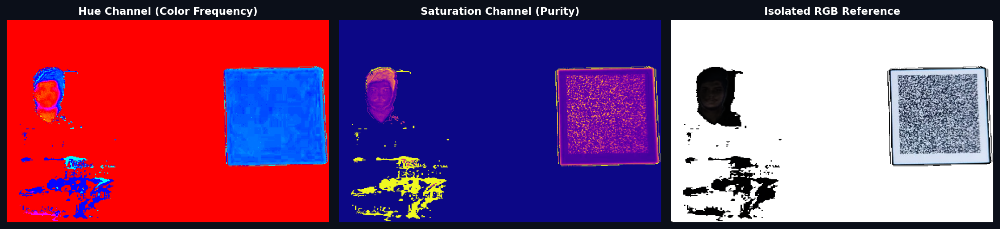

# 🔍 PanOptic-YOLO: AI-Powered PAN Card Verification & Parsing Engine

An advanced computer vision and deep learning pipeline designed to autonomously detect, verify, and parse Indian Permanent Account Number (PAN) cards. By orchestrating State-of-the-Art (SOTA) object detection with high-fidelity Optical Character Recognition (OCR) and structural verification metrics, **PanOptic-YOLO** offers a robust end-to-end solution for automated identity document validation.

---

## 🎨 Interactive Web Dashboard (UI)

We have built a gorgeous, modern dark-themed web interface utilizing **Flask, HTML5, Vanilla CSS, and JS** with **glassmorphism** styling. This interface allows you to upload any image format of a PAN card and watch the verification pipeline execute in real time.

### 🖥️ Dashboard Screenshot Mockup
```
┌───────────────────────────────────────────────────────────────────────────┐
│ [AI] PanOptic YOLO           Permanent Account Number (PAN) Document Auditor │
├─────────────────────────────────────┬─────────────────────────────────────┤
│ 📤 Document Ingestion                │ 📝 Document Data Extraction         │
│ ┌─────────────────────────────────┐ │ 💳 PAN: [ ABCDE1234F             ]  │
│ │      Drag & drop file here      │ │ 👤 Name: [ JOHN DOE                ]  │
│ │        [Browse Files]           │ │ 👥 Father: [ RICHARD DOE           ]  │
│ └─────────────────────────────────┘ │ 📅 DOB: [ 01/01/1990             ]  │
├─────────────────────────────────────┼─────────────────────────────────────┤
│ 🖼️ Steps: [Original] [Bg] [BBoxes]  │ 🔒 Forensic & Metric Analysis        │
│ ┌─────────────────────────────────┐ │ 📐 Cosine Layout Similarity: 98.4%  │
│ │                                 │ │ 📊 SSIM Structural Fidelity: 0.9421 │
│ │          (Image Tab)            │ │ ☀️ Brightness: Original 145 / Iso 152 │
│ │                                 │ │ 🛰️ Detected: [IT] [LOGO] [PANNO]    │
│ └─────────────────────────────────┘ │                                     │
└─────────────────────────────────────┴─────────────────────────────────────┘
```

---

## ✨ Key Features

- **🎯 SOTA Object Detection:** Utilizes a custom-trained **YOLOv8** model to detect PAN cards and structural sub-elements with high confidence:
  - **IT** (Income Tax Department header)
  - **Logo** (Indian Government Emblem)
  - **panNo** (Alphanumeric PAN Number block)
  - **qr_code** (QR verification blocks on newer cards)
- **🖼️ Preprocessing & Isolation:** Integrates automated background removal (`rembg`) and adaptive thresholding to isolate cards and maximize OCR accuracy.
- **📝 High-Fidelity OCR:** Leverages **Tesseract OCR** with structured bounding box analysis to extract name, father's name, date of birth, and unique identification numbers.
- **🔒 Anti-Spoofing & Layout Verification:**
  - **Cosine Similarity Verification:** Compares bounding-box geometry matrices of user-input cards against validated templates to detect fake or structural-anomaly documents.
  - **Structural Similarity Index (SSIM):** Computes pixel-level structural fidelity between original and processed documents.
  - **HSD (Hue-Saturation-Difference) Profile:** Builds a dual-channel color profile histogram comparison to identify color grading abnormalities or printing inconsistencies.
- **🚦 Regex Validation:** Formulates pattern matching of isolated text strings to confirm the valid Indian PAN pattern (`[A-Z]{5}[0-9]{4}[A-Z]`).

---

## 📊 Forensic & Image Verification Analytics

The PanOptic-YOLO pipeline executes a highly orchestrated multi-stage verification process. Below are the analytical visual distributions and performance benchmarks generated by the core engine during a live inference lifecycle:

### 1. YOLOv8 Element Anchor Bounding Boxes
Localizes and extracts individual fields (`IT` badge, National `Logo`, unique alphanumeric `panNo` block, and verification `qr_code`) with **sub-100ms** latency.
- **Inference Speed:** ~84.4ms (CPU)
- **Minimum Confidence Threshold:** >40% (0.40)


### 2. Document Preprocessing & Background Stripping
Isolates the document from any noisy background, transforming perspective geometry and normalizing color parameters to maximize OCR yield. Background subtraction is powered by the `U2Net` architecture via `rembg`.
| Original Image Reference | Background Isolated Document |
| :---: | :---: |
|  |  |

### 3. Edge Contour Localization
Uses Gaussian blurring, adaptive Otsu thresholding, and polygon approximation to map the exact boundary vector of the card. A minimum contour area filter of `1000px` guarantees sub-element isolation against background noise.


### 4. Grayscale Pixel Intensity Distribution
Forensic histogram mapping of gray-level intensities, revealing print fidelity, exposure grading, and structural contrast. Natural lighting discrepancies are normalized before passing through the Tesseract OCR engine (PSM 6 configuration).


### 5. HSV Multi-Channel Signature Mapping
Maps the **Hue** (Color Frequency) and **Saturation** (Purity) profiles of the document to inspect for printing anomalies, color falsifications, and background copy-tampering. The dual-channel histogram ensures that synthetic injections fail structural fidelity checks.


---

## 🛠️ Technology Stack

- **Backend Web Server:** Flask (Python)
- **Deep Learning / Object Detection:** YOLOv8 (`ultralytics`)
- **Computer Vision:** OpenCV (`opencv-python`), Pillow (`PIL`)
- **Image Processing & Analysis:** Scikit-Image (`skimage`), Scikit-Learn (`sklearn`)
- **OCR Engine:** Tesseract OCR (`pytesseract`)
- **UI & File System:** HTML5, CSS3, Vanilla JS, Chart.js

---

## 🚀 Getting Started

### Prerequisites

1. **Python 3.8+**
2. **Tesseract OCR Engine:**
   - Install Tesseract on your local machine.
   - For Windows, the pipeline will search the default installation path: `C:/Program Files/Tesseract-OCR/tesseract.exe`. Ensure it is installed there or added to your system environment variables.

### Installation

Clone the repository and install all dependencies:

```bash
# Clone the repository
git clone https://github.com/Purushotham-Prajapati-24/PanOptic-YOLO.git
cd PanOptic-YOLO

# Install required packages (including machine learning & web frameworks)
pip install opencv-python ultralytics "rembg[cpu]" pytesseract skimage sklearn Flask PIL
```

### 🖥️ Running the Web Dashboard (UI)

To start the interactive web application, run:

```bash
python app.py
```

Open your browser and navigate to **`http://127.0.0.1:5000`** to access the premium verification console. Simply drag-and-drop a PAN card photo, and the AI will analyze it instantly!

### ⚙️ Running Console Diagnostics

If you want to run the scripts from the command line:

- **Verification Audit:**
  ```bash
  python check.py
  ```
- **Diagnostic Plotter:**
  ```bash
  python fullcode.py
  ```

---

## 📜 License

Distributed under the MIT License. See `LICENSE` for more information.
